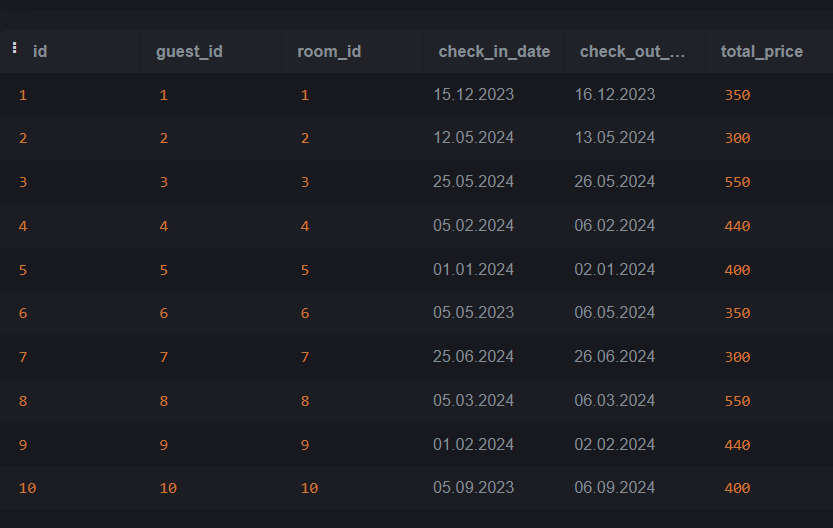
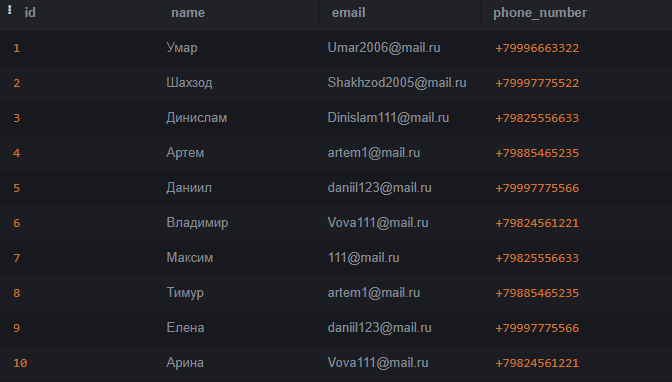
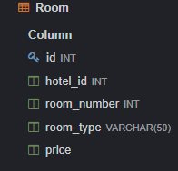
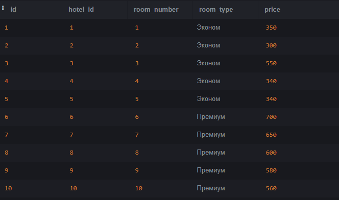

## 1. Мадомилов Бахманёр Шахриёрович, ИС 22/9-1

## 2.

Моя база данных про гостиницу
База данных имеет 4 таблицы

Таблица Booking (таблица хранит сведения о бронировании)

Таблица Guest (таблица хранит сведения о гоятх)

Таблица Hostel (таблица хранит сведения о гостинице)

Таблица Room (таблица хранит сведения о комнатах)

#### 2.1

Таблица Booking состоит из следующих атрибутов:
id - создается по умолчанию, INT
guest_id - айди к таблице Guest, INT
room_id - айди к таблице Room, INT
check_in_date - айди к таблице Booking, Date
check_in_out - айди к таблице Booking, Date
Total_price - цена, float
 
 


Таблица Guest состоит из следующих атрибутов:
id - создается по умолчанию, INT
name - имя клиента, VARCHAR(50)
email - электронная почта клиента, VARCHAR(50)
phone_number - номер телефона клиента, VARCHAR(20)



Таблица Hotel состоит из следующих атрибутов:
id - создается  по умолчанию, INT
name - название гостиницы, VARCHAR(50)
addrees - адрес гостиницы, VARCHAR(100)
city - город в котором находится гостиница, VARCHAR(500)

Таблица Room состоит из слудующих атрибутов:
id - по умолчанию, INT
hotel_id - айди гостиницы, INT
room_id - айди номера, INT
room_type - тип номера, VARCHAR(50)
price - цена номера за сутки, VARCHAR(50)



* Объединил две разные строки в таблице Guest с помощью команды UNION
```
 SELECT name From Guest
 
 UNION
 
 SELECT email FROM Guest
```

* 

